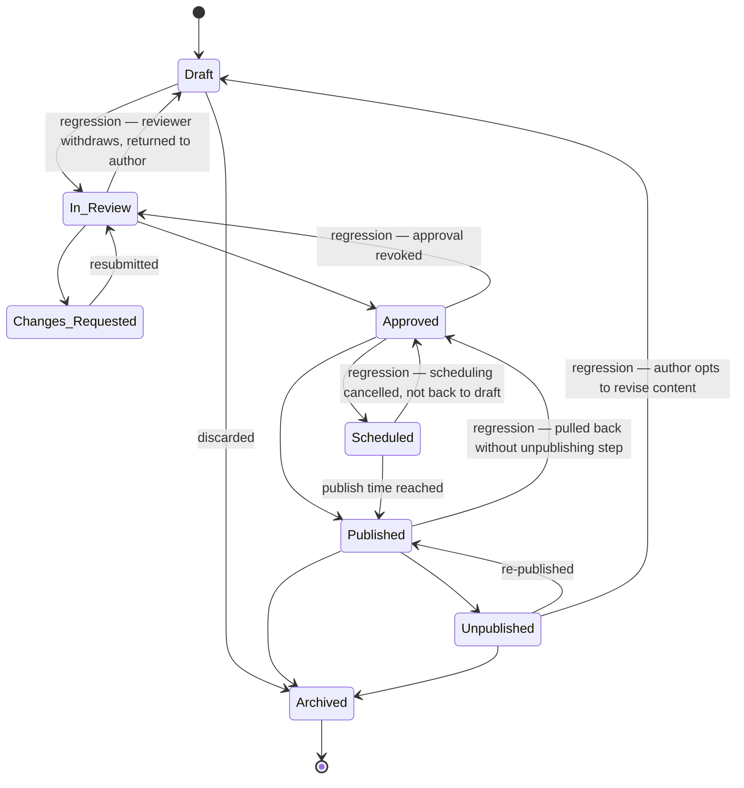

# Document / Content Lifecycle

A **Document** (article, policy, report, content item) moves through an editorial pipeline from authorship to publication and eventual archival. The snapshot system observes its status and must handle reversions that are common in editorial workflows.

---

## Canonical Order (for direction classification)

| Position | Status |
|----------|--------|
| 1 | `Draft` |
| 2 | `In Review` |
| 3 | `Approved` |
| 4 | `Published` |
| 5 | `Archived` |

Branch statuses outside the canonical sequence: `Changes Requested`, `Scheduled`, `Unpublished`.

---

## Status Descriptions

| Status | Meaning |
|--------|---------|
| `Draft` | Being written; only visible to the author and collaborators. |
| `In Review` | Submitted for editorial or peer review. |
| `Changes Requested` | Reviewer has returned the document for revisions. |
| `Approved` | Cleared by reviewer(s); ready for publishing. |
| `Scheduled` | Approved and queued for automatic publication at a future datetime. |
| `Published` | Publicly visible or accessible to the target audience. |
| `Unpublished` | Temporarily pulled from public view; not yet archived. |
| `Archived` | Retired; no longer actively maintained or publicly visible. |

---

## State Diagram

---

## Transition Table

### Forward Progressions

| From | To | Typical cause |
|------|----|--------------|
| Draft | In Review | Author submits for review |
| In Review | Approved | Reviewer approves |
| Approved | Published | Author or system publishes immediately |
| Published | Archived | Admin retires content |

### Lateral Transitions (branch paths)

| From | To | Typical cause |
|------|----|--------------|
| Draft | Archived | Author discards document |
| In Review | Changes Requested | Reviewer requests revisions |
| Changes Requested | In Review | Author resubmits after addressing feedback |
| Approved | Scheduled | Author sets a future publish date |
| Scheduled | Published | Scheduler fires at publish datetime |
| Published | Unpublished | Author or admin pulls content from public view |
| Unpublished | Published | Author or admin re-publishes |
| Unpublished | Archived | Admin permanently retires content |

### Regressions (backward along canonical order)

| From | To | Typical cause in upstream system |
|------|----|----------------------------------|
| In Review | Draft | Reviewer withdraws from review; document returned to author for rework |
| Approved | In Review | Approval revoked (e.g., new stakeholder objects, policy changed) |
| Published | Approved | Document pulled back to approved state, bypassing explicit `Unpublished` step |
| Scheduled | Approved | Scheduling cancelled; document remains approved and ready to reschedule or publish immediately |
| Unpublished | Draft | Author decides to revise content rather than simply re-publish |

---

## Handling Regressions

- **In Review → Draft**: Common in editorial workflows. The review cycle resets. Any notifications sent to reviewers about the submission should be noted as superseded.
- **Approved → In Review**: Approval was granted but then revoked. Any scheduled publication or "approved" indicators surfaced to downstream systems should be retracted.
- **Published → Approved**: This is an unusual path — the document went from public to a pre-publication state without passing through `Unpublished`. It may indicate a data correction in the upstream CMS. The practical effect is the same as `Published → Unpublished`: the document is no longer public.
- **Scheduled → Approved**: The publish date was cancelled. No publication action has occurred. The document is still cleared for publishing and is waiting for a new publish action.
- **Unpublished → Draft**: The author wants to make substantive changes, not just re-publish. This is a regression of two ordinal positions (skipping `In Review`). Note that in the upstream system, the document is now back in the edit-submit-review cycle.

---

## Versioning and Snapshots

In CMS systems that support multi-version documents, a single `Document` entity ID may carry a version number alongside its status. When comparing snapshots, the system should consider whether a status change is on the **same version** or a **new version** of the document:

- Same version, status changed → a genuine status transition, apply direction classification normally.
- New version, status is `Draft` → the upstream system created a new revision; this is not a regression of the published version, it is a new entity in `Draft` state alongside the still-published predecessor.

If version information is not available in the snapshot, treat each status change at face value.
