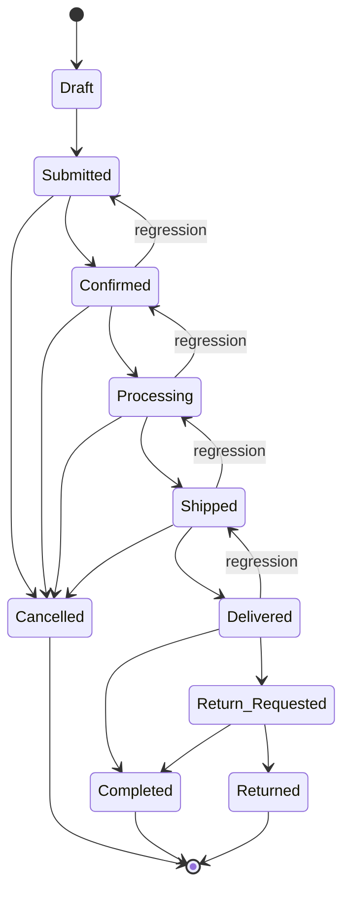

# Order Lifecycle

An **Order** represents a customer's intent to purchase goods or services. The snapshot system observes its status and infers progression, regression, or lateral transitions.

---

## Canonical Order (for direction classification)

| Position | Status |
|----------|--------|
| 1 | `Draft` |
| 2 | `Submitted` |
| 3 | `Confirmed` |
| 4 | `Processing` |
| 5 | `Shipped` |
| 6 | `Delivered` |
| 7 | `Completed` |

Branch statuses outside the canonical sequence: `Cancelled`, `Return Requested`, `Returned`.

---

## Status Descriptions

| Status | Meaning |
|--------|---------|
| `Draft` | Order being assembled; not yet submitted. |
| `Submitted` | Customer has confirmed intent; awaiting merchant acknowledgement. |
| `Confirmed` | Merchant has accepted the order; payment authorized. |
| `Processing` | Items are being picked, packed, or prepared. |
| `Shipped` | Order dispatched; in transit with a carrier. |
| `Delivered` | Carrier confirms delivery to the recipient. |
| `Completed` | Post-delivery window closed; order fully settled. |
| `Cancelled` | Order voided. Reachable from most pre-shipment states. |
| `Return Requested` | Customer has initiated a return after delivery. |
| `Returned` | Goods received back; refund or credit issued. |

---

## State Diagram

---

## Transition Table

### Forward Progressions

| From | To | Typical cause |
|------|----|--------------|
| Draft | Submitted | Customer places order |
| Submitted | Confirmed | Merchant accepts; payment authorized |
| Confirmed | Processing | Fulfillment system picks up order |
| Processing | Shipped | Dispatch with tracking number |
| Shipped | Delivered | Carrier confirms delivery |
| Delivered | Completed | Post-delivery window closes |

### Lateral Transitions (branch paths)

| From | To | Typical cause |
|------|----|--------------|
| Submitted | Cancelled | Payment fails or merchant rejects |
| Confirmed | Cancelled | Customer or merchant cancels before fulfillment |
| Processing | Cancelled | Fulfillment failure (e.g. out of stock) |
| Shipped | Cancelled | Carrier returns undeliverable package |
| Delivered | Return Requested | Customer initiates return |
| Return Requested | Returned | Merchant approves; goods received back |
| Return Requested | Completed | Return claim rejected |

### Regressions (backward along canonical order)

| From | To | Typical cause in upstream system |
|------|----|----------------------------------|
| Processing | Confirmed | Fulfillment started in error; order pulled back for re-confirmation (e.g., payment issue discovered post-processing) |
| Confirmed | Submitted | Payment authorization expired; order needs re-authorization |
| Shipped | Processing | Carrier returned package before delivery; order re-enters fulfillment |
| Delivered | Shipped | Delivery scan was erroneous; carrier corrects status |

---

## Handling Regressions

When the system observes a regression on an Order, consider:

- **Processing → Confirmed**: Any inventory reservation or payment capture triggered at `Confirmed → Processing` may need to be reversed or re-evaluated.
- **Confirmed → Submitted**: Payment authorization state is now uncertain; downstream invoice or billing records should not be finalized until `Confirmed` is re-observed.
- **Shipped → Processing**: A shipping label or dispatch notification may have already been sent to the customer. The regression indicates the upstream system has invalidated that dispatch.
- **Delivered → Shipped**: A delivery confirmation sent to the customer may be premature. This is rare and usually a data correction in the carrier integration.

---

## Terminal States

`Completed`, `Cancelled`, and `Returned` are terminal in the upstream business domain. If the snapshot system observes a transition *out of* one of these states, it indicates a data correction or override in the upstream system and should be flagged for review.
