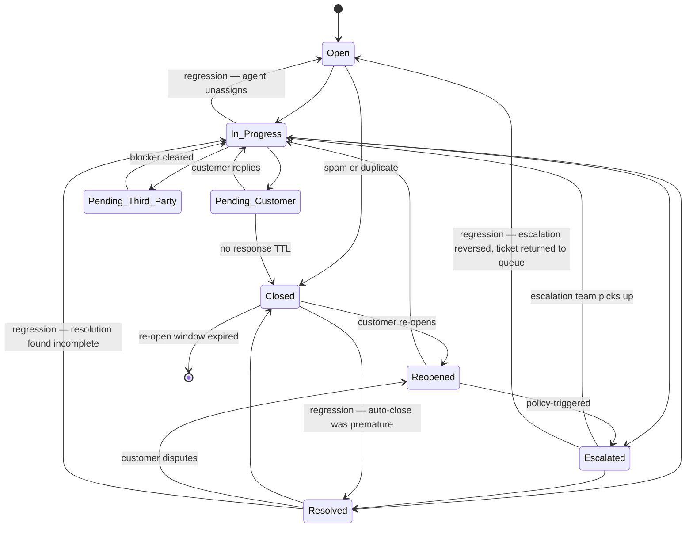

# Support Ticket Lifecycle

A **Support Ticket** tracks a customer issue from the moment it is raised until the problem is confirmed resolved. The snapshot system observes its status and must handle the fluid back-and-forth nature of support work.

---

## Canonical Order (for direction classification)

| Position | Status |
|----------|--------|
| 1 | `Open` |
| 2 | `In Progress` |
| 3 | `Resolved` |
| 4 | `Closed` |

Branch statuses outside the canonical sequence: `Pending Customer`, `Pending Third Party`, `Escalated`, `Reopened`.

These branch statuses represent holding or routing states. They do not advance the canonical lifecycle on their own — a ticket returns to `In Progress` or `Resolved` to continue progressing.

---

## Status Descriptions

| Status | Meaning |
|--------|---------|
| `Open` | Ticket received; not yet assigned or worked. |
| `In Progress` | An agent is actively investigating or working the issue. |
| `Pending Customer` | Waiting on information or confirmation from the customer. |
| `Pending Third Party` | Blocked on an external party (vendor, partner, internal team). |
| `Escalated` | Transferred to a higher-tier team. |
| `Resolved` | Agent has marked the issue as fixed. |
| `Closed` | Confirmed resolved or auto-closed after inactivity. |
| `Reopened` | Customer reports the issue persists after resolution or close. |

---

## State Diagram

---

## Transition Table

### Forward Progressions

| From | To | Typical cause |
|------|----|--------------|
| Open | In Progress | Agent assigns ticket |
| In Progress | Resolved | Agent marks issue fixed |
| Resolved | Closed | Customer confirms or auto-close TTL elapses |

### Lateral Transitions (branch paths)

| From | To | Typical cause |
|------|----|--------------|
| Open | Closed | System detects spam or duplicate |
| In Progress | Pending Customer | Agent requests more information |
| In Progress | Pending Third Party | Blocked on external dependency |
| In Progress | Escalated | Agent escalates or SLA timer triggers |
| Pending Customer | In Progress | Customer replies |
| Pending Customer | Closed | No customer response within TTL |
| Pending Third Party | In Progress | External blocker resolved |
| Escalated | In Progress | Escalation team accepts ticket |
| Escalated | Resolved | Escalation team resolves directly |
| Resolved | Reopened | Customer disputes resolution |
| Closed | Reopened | Customer re-opens within allowed window |
| Reopened | In Progress | Agent re-engages |
| Reopened | Escalated | Second reopen triggers policy rule |

### Regressions (backward along canonical order)

| From | To | Typical cause in upstream system |
|------|----|----------------------------------|
| In Progress | Open | Agent unassigns ticket; returns to unworked queue |
| Resolved | In Progress | Resolution found to be incomplete or incorrect |
| Closed | Resolved | Auto-close was premature; ticket re-opened for review |
| Escalated | Open | Escalation reversed; ticket returned to general queue (the ticket regresses past `In Progress`) |

---

## Handling Regressions

Support tickets are among the most fluid entities — regressions here are common and routine:

- **In Progress → Open**: The ticket effectively re-queues. Any SLA clock adjustments made when the ticket was assigned may need recalculating.
- **Resolved → In Progress**: The most operationally significant regression. Any customer-facing "your issue is resolved" communication triggered at `Resolved` is now incorrect. The system should flag this for potential follow-up messaging.
- **Closed → Resolved**: If the `Closed` state triggered satisfaction survey dispatch or case archival, those actions should be noted as premature. Do not re-trigger them when `Closed` is re-observed.
- **Escalated → Open**: The ticket has skipped backward past `In Progress`. The system should treat this as a gap of two ordinal positions and consider whether any intermediate handlers for `In Progress` need to run.

---

## Skipped States

Because snapshots may not be continuous, the system can observe transitions that skip multiple positions — for example, seeing `Open` and then `Resolved` with no observed `In Progress` snapshot in between. This is not an error; it means the upstream system moved through intermediate statuses between snapshot windows. The system should record the observed before/after and not attempt to synthesise the missing intermediate states unless explicitly required by downstream consumers.
