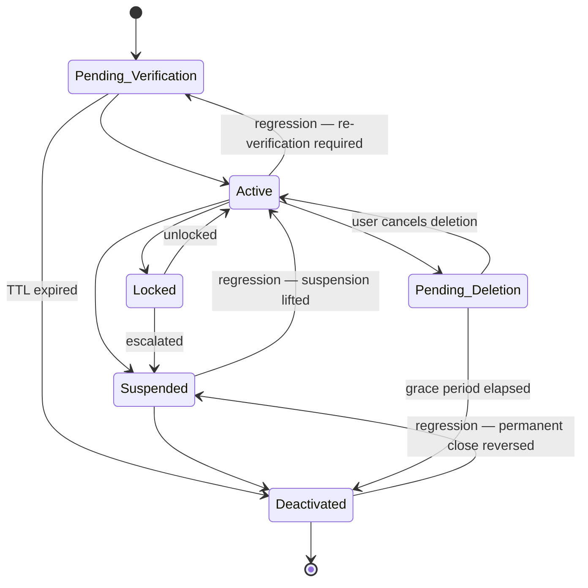

# User Account Lifecycle

A **User Account** represents an identity in the system. The snapshot system observes its status across registration, ongoing access management, and eventual deactivation.

---

## Canonical Order (for direction classification)

| Position | Status |
|----------|--------|
| 1 | `Pending Verification` |
| 2 | `Active` |
| 3 | `Suspended` |
| 4 | `Deactivated` |

Branch statuses outside the canonical sequence: `Locked`, `Pending Deletion`.

`Locked` is treated as a branch rather than a canonical step because it is a temporary security hold that can resolve back to `Active` — it does not represent forward progress in the account's lifecycle.

---

## Status Descriptions

| Status | Meaning |
|--------|---------|
| `Pending Verification` | Account created; email/identity not yet confirmed. |
| `Active` | Verified and in normal use. |
| `Locked` | Temporarily inaccessible due to security policy (e.g., too many failed logins). |
| `Suspended` | Administratively restricted; the user cannot log in. |
| `Pending Deletion` | User requested account deletion; grace period is running. |
| `Deactivated` | Permanently closed. |

---

## State Diagram

---

## Transition Table

### Forward Progressions

| From | To | Typical cause |
|------|----|--------------|
| Pending Verification | Active | User completes email/identity verification |
| Active | Suspended | Admin applies restriction |
| Suspended | Deactivated | Admin permanently closes account |

### Lateral Transitions (branch paths)

| From | To | Typical cause |
|------|----|--------------|
| Pending Verification | Deactivated | Verification TTL expired with no action |
| Active | Locked | Failed login threshold exceeded |
| Active | Pending Deletion | User initiates deletion request |
| Locked | Active | User completes unlock flow or admin resets |
| Locked | Suspended | Admin escalates during lockout |
| Pending Deletion | Active | User cancels within grace period |
| Pending Deletion | Deactivated | Grace period elapses |

### Regressions (backward along canonical order)

| From | To | Typical cause in upstream system |
|------|----|----------------------------------|
| Suspended | Active | Admin lifts suspension; account restored to normal use |
| Deactivated | Suspended | Upstream system reverses a permanent close (exceptional; usually a data correction) |
| Active | Pending Verification | Re-verification required (e.g., security policy change, email address changed) |

---

## Handling Regressions

- **Suspended → Active**: The most common regression. Access controls, tokens, and session state need to be re-evaluated as if the account is healthy again.
- **Deactivated → Suspended**: Rare and significant. If any data anonymisation or deletion was triggered upon `Deactivated`, this regression signals a serious upstream correction. Flag immediately.
- **Active → Pending Verification**: The account is functionally restricted until reverified. Any sessions or tokens issued during `Active` should be treated as potentially stale.

---

## Terminal States

`Deactivated` is terminal in the upstream business domain. A snapshot showing a transition out of `Deactivated` (other than to `Suspended` as a data correction) should be treated as anomalous and flagged for review.
